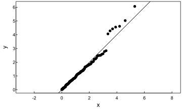
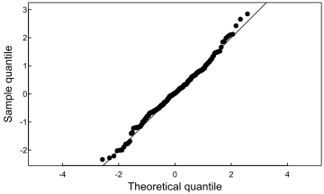
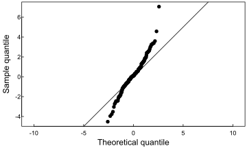
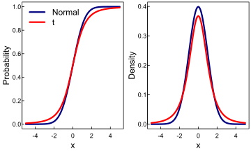

Which quantiles of a continuous distribution can one estimate with more precision?
==================================================================================

The median is an important quantity in data analysis. It represents the
middle value of the data distribution. Estimates of the median, however,
have a degree of uncertainty because (a) the estimates are calculated
from a finite sample and (b) the data distribution of the underlying
data is generally unknown. One important roles of a data scientist is to
quantify and to communicate the degree of uncertainty in his or her data
analysis.

Assignment
----------

In this assignment, you will write a blog post to answer a series of
questions related to the variation of the median (and a range of other
quantiles). You will use analytic methods to answer the questions.

The audience of your blog post is a Senior Data Scientist who you hope
to work with in the future. Your goal is to document how you wrote
flexible functions for the distribution of order statistics.

Questions
---------

**Q:** Begin with the median from a sample of *N* = 200 from the
standard normal distribution. Write an R function that is the density
function for the median in this sample. Note that the 100th order
statistic is approximately the median, and use the order statistic
formula discussed in class. Generate a plot of the function.

``` r
dorder <- function(x){
  
}
```

**Q:** Write an R function that is the probability function for the
median in this sample. Use the order statistic formula discussed in
class. Generate a plot of the function.

``` r
porder <- function(x){
  
}
```

**Q:** Write an R function that is the quantile function for the median
in this sample. (You have several options for how to write this
function.) Generate a plot of the function.

``` r
qorder <- function(p){
  
}
```

**Q:** Simulate the sampling distribution for the median. Create a plot
of the empirical CDF (ECDF). Overlay the plot of the ECDF with a plot of
the CDF.

**Q:** Using the simulated sampling distribution from the previous
question, create a histogram (on the density scale). Overlay the
histogram with a plot of the density function.

**Q:** One very common way to compare a random sample to a theoretical
candidate distribution is the QQ plot. It is created by ploting
quantiles of the theoretical distribution on the x-axis and empirical
quantiles from the sample on the y-axis.

If sample and theoretical quantiles come from the same distribution,
then the plotted points will fall along the line *y* = *x*,
approximately. Here are two examples when the sample and theoretical
quantiles came from the same distribution.

``` r
random_sample <- rexp(200)
q_candidate <- qexp

x <- q_candidate((1:200)/200)
y <- quantile(random_sample, probs = (1:200)/200)

svg("./assets/exponential-qq.svg", width = 5, height = 3)
tgsify::plotstyle(style = upright)
plot(x,y, asp = 1)
abline(0,1)
dev.off()
```

``` r
random_sample <- rnorm(200)
q_candidate <- qnorm

x <- q_candidate((1:200)/200)
y <- quantile(random_sample, probs = (1:200)/200)

svg("./assets/normal-qq.svg", width = 5, height = 3)
tgsify::plotstyle(style = upright)
plot(x,y, asp = 1, xlab = "Theoretical quantile", ylab = "Sample quantile")
abline(0,1)
dev.off()
```





Here is an example when the sample distribution does not match with the
theoretical distribution. The sample distribution is *t*<sub>3</sub>
where as the theoretical distribution is *N*(0, 1). Notice the deviation
from *y* = *x*.

``` r
random_sample <- rt(200, df = 3)
q_candidate <- qnorm

x <- q_candidate((1:200)/200)
y <- quantile(random_sample, probs = (1:200)/200)

svg("./assets/t-normal-qq.svg", width = 5, height = 3)
tgsify::plotstyle(style = upright)
plot(x,y, asp = 1, xlab = "Theoretical quantile", ylab = "Sample quantile")
abline(0,1)
dev.off()
```



The deviation occurs despite the fact that the two distributions are
similar.



For the assigment, generate a QQ plot for the simulated data of the
median relative to the known sampling distribution of the median.

Does the simulated data agree with the theoretical sampling
distribution?

**Q:** Modify the `dorder`, `porder`, and `qorder` functions so that the
functions take a new parameter `k` (for the *k*<sup>*t**h*</sup> order
statistic) so that the functions will work for any order statistic and
not just the median.

**Q:** Generate the QQ plot for simulated data from the sampling
distribution of the sample max and the theoretical largest order
statistic distribution.

**Q:** Modify the `dorder`, `porder`, and `qorder` functions so that the
functions take new parameters `dist` and `...` so that the functions
will work for any continuous distribution that has `d` and `p` functions
defined in R.

**Q:** Use the newly modified functions to plot the probability and
density functions for the sample min (*N* = 200).

Submission instructions
-----------------------

1.  Within the repo
    `Probability and Inference Portfolio Lastname Firstname`, create a
    folder called `06-order-statistics`
2.  Within the folder, create an .html for your blog post
3.  **The name of the blog post file must be `writeup.html`**
4.  Within the folder, include code scripts or .rmd or some other
    document that will successfully generate the output of the
    simulation when executed from within the folder. (Do not use
    absolute file paths.)
5.  Edit the README to be an index for the portfolio.  
6.  Be prepared to share your blog post with the class when the
    deliverable is due.

Other instructions
------------------

1.  The deliverable should be your own work. You may **discuss**
    concepts with classmates, but you may **not share** code or text.
