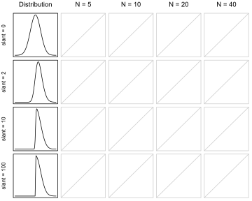

Simulation study: CLT
=====================

The central limit theorem is an important computational short-cut for
generating and making inference from the sampling distribution of the
mean. You’ll recall that the central limit theorem short-cut relies on a
number of conditions, specifically:

1.  Independent observations
2.  Identically distributed observations
3.  Mean and variance exist
4.  Sample size large enough for convergence

In this simulation study, you are going to compare the sampling
distribution of the mean generated by simulation to the sampling
distribution implied by the central limit theorem. You will compare the
distributions graphically in QQ-plots.

This will be a 4 × 4 factorial experiment. The first factor will be the
sample size, with N = 5, 10, 20, and 40. The second factor will be the
degree of skewness in the underlying distribution. The underlying
distribution will be the Skew-Normal distribution. The Skew-Normal
distribution has three parameters: location, scale, and slant. When the
slant parameter is 0, the distribution reverts to the normal
distribution. As the slant parameter increases, the distribution becomes
increasingly skewed. In this simulation, slant will be set to 0, 2, 10,
100. Set location and scale to 0 and 1, respectively, for all simulation
settings.

Use the `rsn` function in the `sn` package.

The output of each combination of factors will be a QQ-plot. Generate a
sampling distribution of 5000 draws from both the CLT approximation and
the simulation approximation. When analyzing data, the parameters for
the mean and variance (in the case of the CLT shortcut) or the
parameters for the distribution (in the case of MLE, MM, etc) are
replaced with sample estimates. (This is often called the plug-in
approach.) For the purposes of this simulation, treat the mean and
variance as known values and use the actual population parameters and
the population mean and variance instead of sample estimates.

Here is a template that may help for generating the QQ-plot for a single
simulation setting

``` r
require(magrittr)
# Parameters that do not change
R <- 5000; location <- 0; scale <- 1

# Parameters that change
N <- 5
slant <- 10

# Quantites to calculate/generate
pop_mean <- ... code here ...#
pop_sd <- ... code here ...#
sample_dist_clt <- ... code here ...#
sample_dist_sim <- ... code here ...#

# QQ plot
qqplot(sample_dist_sim, sample_dist_clt, asp = 1)
abline(0,1)

# Optional (Dislay the 95% CI from the clt and the sim)
... code here ...
```

The table of figures below is a possible (but not required) template for
displaying the results.



You will write a blog post to explain your simulation study and results.
The audience of your blog post is a Senior Data Scientist who you hope
to work with in the future. Think about how you will communicate the
results. Comment on any patterns you observe.

Advanced (optional)
-------------------

Overlay in each figure the QQ-plot that results when the mean and
variance parameters are estimated from data, instead of using the
population parameters.

Submission instructions
-----------------------

1.  Within the repo
    `Probability and Inference Portfolio Lastname Firstname`, create a
    folder called `10-CLT-approximation`
2.  Within the folder, create an .html for your blog post
3.  **The name of the blog post file must be `writeup.html`**
4.  Within the folder, include code scripts or .rmd or some other
    document that will successfully generate the output of the
    simulation when executed from within the folder. (Do not use
    absolute file paths.)
5.  Edit the README to be an index for the portfolio.  
6.  Be prepared to share your blog post with the class when the
    deliverable is due.

Other instructions
------------------

1.  The deliverable should be your own work. You may **discuss**
    concepts with classmates, but you may **not share** code or text.
