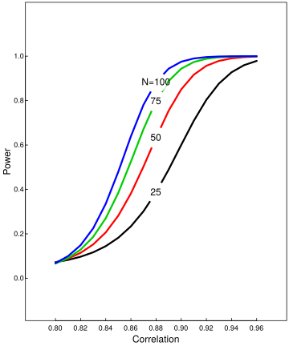

Simulation study: Power and sample size calculations correlational studies
==========================================================================

A common research objective is to demonstrate that two measurements are
highly correlated. One measurement, call it A, may reflect the severity
of disease but is difficult or costly to collect. Another measurement,
call it B, may be easier to collect and potentially related to
measurement A. If there is strong association between A and B, a cost
effective strategy for diagnosis may be to collect measurement B instead
of A.

In this deliverable, you will perform a power and sample size
calculation for a collaborator who is submitting a grant application to
fund a study to show that two measurements are highly correlated.
Reviewers of the grant want to fund studies that have a high likelihood
of success, which in this setting is conclusively demonstrating that the
correlation between A and B is greater than 0.8.

The researcher will collect both measurements on N individuals. The
analysis will proceed by calculating a one-sided confidence interval. If
the confidence interval is completely within the range from 0.8 to 1,
then the researcher will consider the study to be a success: A
conclusive demonstration that the correlation between A and B is greater
than 0.8.

**Power** is the probability that the study will end in success when the
true underlying correlation is, in fact, greater that 0.8. (Note the
connection to Type II error (β): **power** = 1 - β.) Your collaborator
needs you to estimate power for different combinations of sample size
and the true population correlation. Let the sample size be 25, 50, 75,
and 100. Let the population correlation range from 0.8 to 0.95.

The code below provides the power calculation for a single combination
of N and population correlation.

``` r
set.seed(20394)
suppressPackageStartupMessages(require(mvtnorm))
N <- 50
rho <- .8
null_correlation <- 0.8
R <- 5000

sigma <- array(c(1,rho,rho,1), c(2,2))
mu <- c(0,0)

detect <- rep(NA, R)
for(i in 1:R){
  data <- rmvnorm(N, mean = mu, sigma = sigma)
  results <- cor.test(x = data[,1], y = data[,2], alternative = "greater")
  detect[i] <- results$conf.int[1] > null_correlation
}
power <- mean(detect)
```

You will write a blog post to explain your simulation study and results.
The audience of your blog post is the grant reviewers. Describe the
simulation. Comment on any patterns you observe. Generate the following
plot to include in the write-up.



Submission instructions
-----------------------

1.  Within the repo
    `Probability and Inference Portfolio Lastname Firstname`, create a
    folder called `11-correlation-power`
2.  Within the folder, create an .html for your blog post
3.  **The name of the blog post file must be `writeup.html`**
4.  Within the folder, include code scripts or .rmd or some other
    document that will successfully generate the output of the
    simulation when executed from within the folder. (Do not use
    absolute file paths.)
5.  Edit the README to be an index for the portfolio.  
6.  Be prepared to share your blog post with the class when the
    deliverable is due.

Other instructions
------------------

1.  The deliverable should be your own work. You may **discuss**
    concepts with classmates, but you may **not share** code or text.
